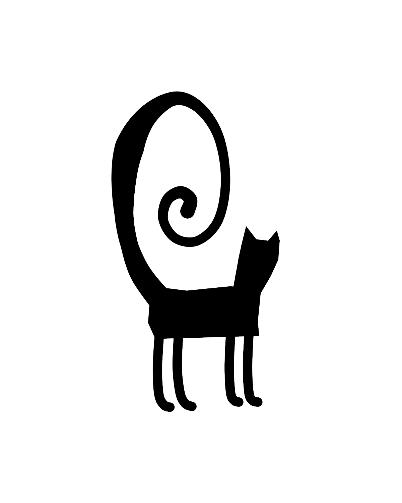
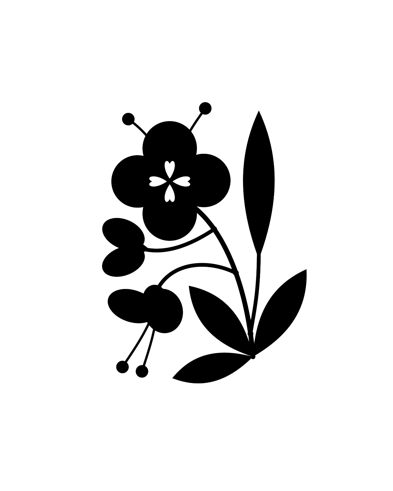
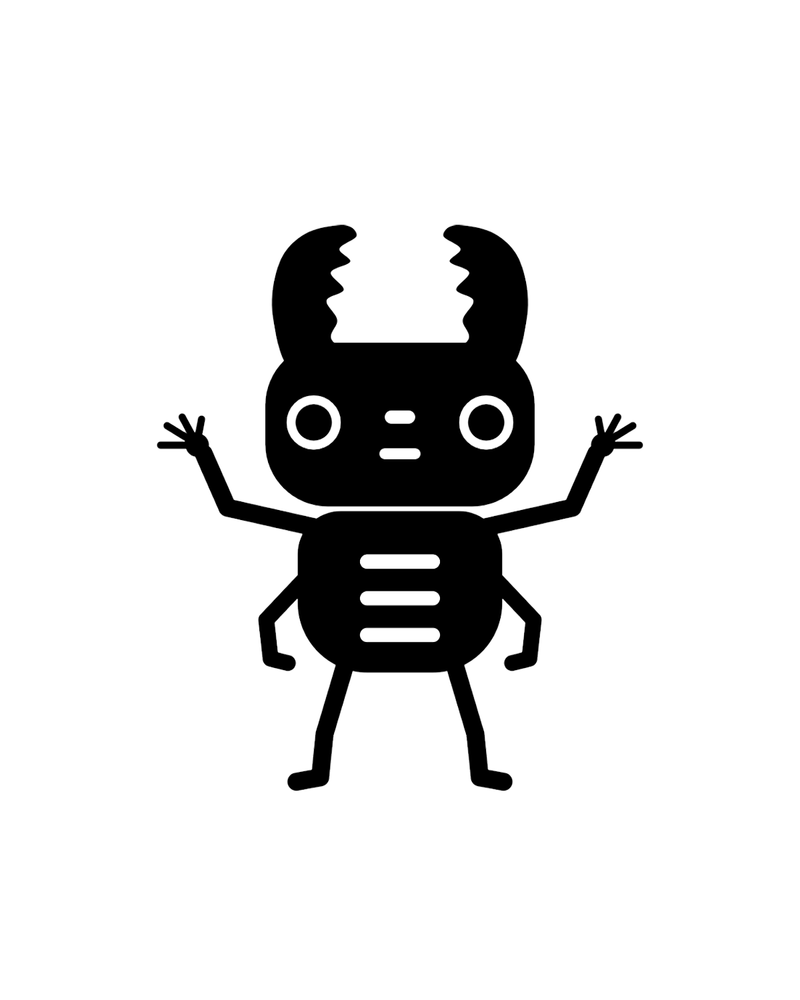
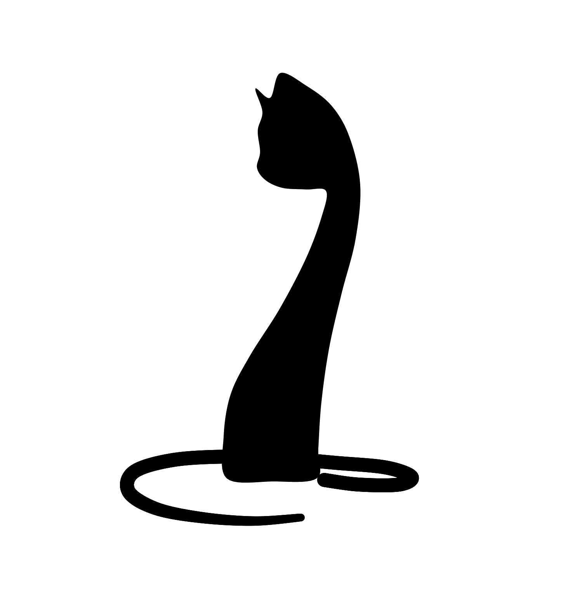

  

    

  

 

  
  &nbsp;&nbsp;&nbsp;&nbsp;
  
  &nbsp;&nbsp;&nbsp;&nbsp;
  

  

  
  &nbsp;&nbsp;
  
  &nbsp;&nbsp;
  

 

  
  &nbsp;&nbsp;
  
  &nbsp;&nbsp;
  

 

  Personal archive — CART 253

